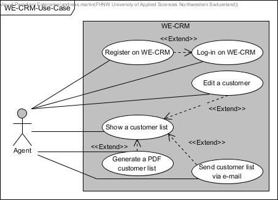

# WE-CRM

## Summary
This is a reference project elaborated by the students step-by-step in every FHNW web engineering lecture.

## Process

### Analysis

#### Scenario
WE-CRM (Web Engineering Customer-Relationship-Management) is the smallest possible and lightweight demonstration tool that allows agents to manage their customer data. Agents have an own access to their customer data. Besides, agents can email themselves an complete extract or create a PDF of their customers.

#### Use Case



- UC-1 [Login on WE-CRM]: Agents can log-in by entering an email address and password. As an extension, new agents my register first.
- UC-2 [Register on WE-CRM]: Agents can register to get an account (profile) to access the WE-CRM system.
- UC-3 [Edit a customer]: Agents can create, update and delete customers.
- UC-4 [Show a customer list]: Agents can get an overview over their customers based on a customer list. As an extension they can create, update and delete customers (UC-3), generate a PDF (UC-5) or send an email (UC-6).
- UC-5 [Generate a PDF customer list]: Agents can generate a PDF containing a list of their customers.
- UC-6 [Send customer list via email]: Agents can send an email containing a list of their customers to their own inbox.

#### Constraints

### Design

#### Solution Strategy

#### Wireframe


#### Domain Model


#### ERD


#### Data Access


#### Business Logic


### Implementation

#### SQL

##### PostgreSQL
```SQL
CREATE TABLE Customer (
  ID      SERIAL NOT NULL,
  Name    varchar(255),
  Email   varchar(255),
  Mobile  varchar(255),
  AgentID int4 NOT NULL,
  PRIMARY KEY (ID));
CREATE TABLE Agent (
  ID       SERIAL NOT NULL,
  Name     varchar(255),
  Email    varchar(255),
  Password varchar(255),
  PRIMARY KEY (ID));
ALTER TABLE Customer ADD CONSTRAINT AgentCustomer FOREIGN KEY (AgentID) REFERENCES Agent (ID);
```

#### Stage 1: Building a Static Website with Bootstrap

In stage 01 a bootstrap based prototype has been created by using a prototyping application. 

In this case, the prototype application Bootstrap Studio has been used to create a basic user interface design based on an HTML grid, Bootstrap CSS and JavaScript, including the selection of web fonts and font-based icons.

The assets (HTML, CSS, JavaScript, image and font files) has been exported and will be extended in the later stages by PHP logic, and later with jQuery, to build a dynamic website.

#### Stage 2:

````apacheconf
RewriteEngine On

RewriteCond %{HTTP_HOST} ^(.*)\.herokuapp\.com$
RewriteCond %{HTTPS} off
RewriteCond %{HTTP:X-Forwarded-Proto} !https
RewriteRule ^ https://%{HTTP_HOST}%{REQUEST_URI} [QSA,L,R=301]

RewriteCond %{REQUEST_FILENAME} !-d
RewriteCond %{REQUEST_FILENAME} !-f
RewriteRule ^(?!.*assets/)(.*) index.php [L,E=ORIGINAL_PATH:/$1]
RewriteRule assets/(.*) view/assets/$1 [NC,L]
````

#### Stage 3:
un-comment the following lines in php.ini:

extension=php_pdo_pgsql.dll
extension=php_pgsql.dll

```SQL
INSERT INTO agent (email, password) VALUES ('test@test.org','secret');
```

### Evaluation and Deployment

#### Heroku Deployment

[](https://heroku.com/deploy)

## Releases

### 1.0.0

- Initial version

## Maintainer

- [Andreas Martin](https://github.com/andreasmartin)

## License

- [Apache License, Version 2.0](LICENSE)
